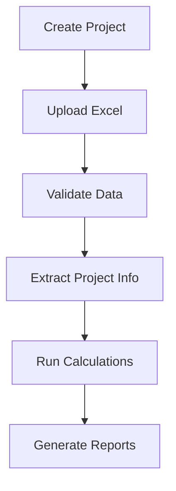

# PV ROUTES DOCUMENTATION

> **Last Updated**: June 30, 2025  
> **Version**: 1.0.0  
> **Maintainer**: Solar Engineering Team

## 📁 ROUTES STRUCTURE OVERVIEW

This directory contains all FastAPI route handlers for the Solar PV Calculation System. Each file has a specific responsibility and is designed for modularity and maintainability.

```
routes/
├── pv_calculations.py    # String & circuit calculations with standards
├── pv_data.py           # Excel data validation & extraction  
├── pv_projects.py       # Project lifecycle management
└── ROUTES_README.md     # This documentation file
```

---

## 🧮 pv_calculations.py

**PRIMARY PURPOSE**: PV string and circuit calculations with normative standards

### 🎯 **What it does**:
- Calculates string configurations using IEC/NEC/Custom standards
- Integrates with panel database for automatic parameter loading
- Handles custom parameter calculations for specialized scenarios
- Provides calculation configuration management
- Maintains backward compatibility with legacy systems

### 🔌 **Key Endpoints**:
- `GET /calculate-strings/{project_name}` - Standard calculations
- `POST /calculate-strings-custom/{project_name}` - Custom parameters
- `GET /available-standards` - List calculation standards
- `GET /available-panels` - Panel database access

### 🔧 **When to modify**:
- Adding new calculation standards (CNBR, AS, etc.)
- Implementing new calculation algorithms
- Adding panel database features
- Integrating ML optimization suggestions

### 📊 **Dependencies**:
- Panel database (configs/panel_database.yaml)
- Normative rules (configs/normativas.yaml)  
- String calculator service
- Project data from pv_data.py

---

## 📋 pv_data.py

**PRIMARY PURPOSE**: Excel data validation, extraction, and manipulation

### 🎯 **What it does**:
- Validates Excel content against business rules
- Extracts data from Excel sheets to JSON format
- Provides preview capabilities for large files
- Handles data sanitization and error cleanup
- Manages sheet-specific data access

### 🔌 **Key Endpoints**:
- `GET /validate-excel-content/{project_name}` - Full validation
- `GET /excel-data/{project_name}` - Complete data extraction
- `GET /excel-preview/{project_name}` - Limited preview
- `GET /excel-sheet/{project_name}/{sheet_name}` - Single sheet access

### 🔧 **When to modify**:
- Adding new validation rules
- Supporting additional Excel sheet types
- Implementing data transformation features
- Adding data quality metrics

### 📊 **Dependencies**:
- Excel parser service
- Validation engine
- File system utilities

---

## 📁 pv_projects.py

**PRIMARY PURPOSE**: Project lifecycle management and CRUD operations

### 🎯 **What it does**:
- Creates and manages project folder structures
- Handles Excel file uploads with validation
- Provides project listing and status information
- Manages project deletion with safety controls
- Integrates project info with panel database

### 🔌 **Key Endpoints**:
- `POST /create-project` - Create new project
- `GET /list-projects` - List all projects with metadata
- `DELETE /delete-project/{project_name}` - Safe project deletion
- `POST /upload-excel/{project_name}` - File upload management
- `GET /project-info/{project_name}` - Comprehensive project info

### 🔧 **When to modify**:
- Adding project templates
- Implementing project versioning
- Adding collaboration features
- Extending metadata management

### 📊 **Dependencies**:
- File system utilities
- Excel parser (for project info)
- Panel database integration

---

## 🔄 INTERACTION FLOW

### Typical Usage Pattern:


### File Dependencies:
```
pv_projects.py ────┐
                   ├─→ pv_data.py ────→ pv_calculations.py
                   └─→ Panel Database
```

---

## 🚀 FUTURE ROADMAP

### Planned Additions:
- **`pv_analysis.py`** - ML analysis and optimization
- **`pv_reporting.py`** - Report generation and export
- **`pv_optimization.py`** - System design optimization
- **`pv_monitoring.py`** - Real-time calculation monitoring

### Integration Points:
- External design tools (PVsyst, Helioscope)
- Weather data APIs
- Component databases
- Compliance checking systems

---

## 🛠️ DEVELOPMENT GUIDELINES

### When Adding New Endpoints:
1. **Choose the right file** based on primary responsibility
2. **Add comprehensive docstrings** with examples
3. **Include proper error handling** and logging
4. **Update this documentation** with new endpoints
5. **Consider backward compatibility** with existing systems

### Naming Conventions:
- **File names**: `pv_{domain}.py` (lowercase, underscore)
- **Endpoint names**: `/descriptive-action-name` (kebab-case)
- **Function names**: `descriptive_action_name` (snake_case)

### Error Handling Standards:
- Use appropriate HTTP status codes
- Provide detailed error messages
- Log all errors with context
- Include suggestion for resolution when possible

---

## 📞 SUPPORT & MAINTENANCE

### Common Issues:
- **Import errors**: Check service dependencies
- **File not found**: Verify project structure
- **Validation failures**: Check Excel format compliance
- **Calculation errors**: Verify panel database integration

### Debugging Tips:
- Check logs for detailed error traces
- Verify file permissions in projects directory
- Ensure all required config files exist
- Test with minimal example projects

### Contact Information:
- **Primary Maintainer**: Solar Engineering Team
- **Repository**: [Internal GitLab/GitHub URL]
- **Documentation**: [Internal Wiki URL]
- **Issue Tracking**: [Internal Jira/GitHub Issues URL]

---

## ⚙️ CONFIGURATION & SETUP

### Required Configuration Files:
```
backend/configs/
├── panel_database.yaml      # Panel specifications database
├── normativas.yaml          # Calculation standards (IEC, NEC, etc.)
├── material_properties.yaml # Cable and material properties
└── standard_sections.yaml   # Standard cable sections
```

### Environment Dependencies:
- **FastAPI**: Web framework for API routes
- **Pandas**: Excel data processing
- **Pydantic**: Request/response validation
- **PyYAML**: Configuration file parsing

### File System Structure:
```
backend/projects/
├── {project_name}/
│   ├── input.xlsx           # Main project data
│   ├── calculations/        # Generated results
│   └── reports/            # Output files
```

---

## 🔐 SECURITY CONSIDERATIONS

### Input Validation:
- Project names validated against directory traversal
- Excel files restricted to .xlsx format only
- File size limits enforced during upload
- Path sanitization for all file operations

### Access Control:
- All operations logged for audit trail
- Deletion requires explicit confirmation
- File access restricted to project directories
- No direct file system access exposed

### Data Privacy:
- Project data isolated by directory structure
- No cross-project data access
- Temporary files cleaned up automatically
- Error messages sanitized to prevent information leakage

---

## 📊 PERFORMANCE CONSIDERATIONS

### Optimization Strategies:
- **Excel Preview**: Limited to 3 rows for quick loading
- **Lazy Loading**: Sheet-specific data access available
- **Caching**: Panel database loaded once per request
- **Streaming**: Large file operations use streaming where possible

### Monitoring Points:
- File upload sizes and processing time
- Excel parsing performance for large files
- Calculation execution time by project size
- Memory usage during data extraction

### Scalability Notes:
- Routes designed for horizontal scaling
- Stateless design allows load balancing
- File operations can be moved to cloud storage
- Database operations ready for connection pooling

---

## 🧪 TESTING GUIDELINES

### Unit Testing:
- Test each endpoint independently
- Mock external dependencies (file system, databases)
- Validate error handling scenarios
- Test edge cases (empty files, malformed data)

### Integration Testing:
- Test complete workflows (create → upload → validate → calculate)
- Verify cross-file interactions
- Test file system operations
- Validate Excel processing end-to-end

### Test Data Requirements:
```
test_data/
├── valid_project.xlsx       # Complete valid Excel file
├── invalid_structure.xlsx   # Missing sheets/columns
├── invalid_data.xlsx       # Invalid data values
└── large_project.xlsx      # Performance testing file
```

---

## 📈 MONITORING & METRICS

### Key Metrics to Track:
- **Request Volume**: Requests per endpoint per hour
- **Response Times**: 95th percentile response times
- **Error Rates**: 4xx and 5xx error percentages
- **File Operations**: Upload success rates and sizes

### Logging Standards:
```python
# Example logging format
logger.info(f"Project created: {project_name}, Size: {file_size}MB, Duration: {duration}ms")
logger.error(f"Validation failed: {project_name}, Errors: {error_count}, Details: {error_summary}")
logger.warning(f"Legacy endpoint used: {endpoint}, Project: {project_name}")
```

### Health Check Endpoints:
Consider adding:
- `/health` - Basic service health
- `/metrics` - Performance metrics
- `/status` - Detailed system status

---

## 🔄 MIGRATION & UPDATES

### Backward Compatibility:
- Legacy endpoints maintained with deprecation warnings
- Version headers supported for API evolution
- Old response formats supported during transition
- Migration guides provided for breaking changes

### Update Procedures:
1. **New Features**: Add to appropriate domain file
2. **Breaking Changes**: Version the API or provide compatibility layer
3. **Deprecations**: Add warnings and migration timeline
4. **Documentation**: Update this file and endpoint docs

### Version Management:
- Semantic versioning for route modules
- API versioning through headers or URL paths
- Feature flags for gradual rollouts
- Rollback procedures for failed deployments

---

## 📚 ADDITIONAL RESOURCES

### Related Documentation:
- **API Reference**: Generated from OpenAPI specs
- **Service Layer Docs**: Backend services documentation
- **Database Schema**: Panel and configuration data structure
- **Frontend Integration**: API consumption guidelines

### External References:
- **IEC 62548**: International PV system design standard
- **NEC 690**: US National Electrical Code for PV
- **FastAPI Docs**: https://fastapi.tiangolo.com/
- **Pandas Docs**: https://pandas.pydata.org/docs/

### Training Materials:
- Solar PV calculation fundamentals
- FastAPI development best practices
- Excel data processing techniques
- Error handling and logging standards

---

*End of Routes Documentation*